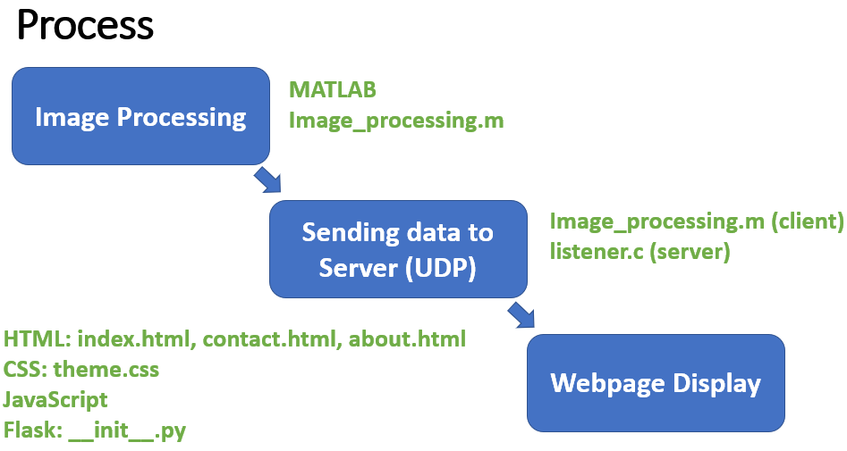
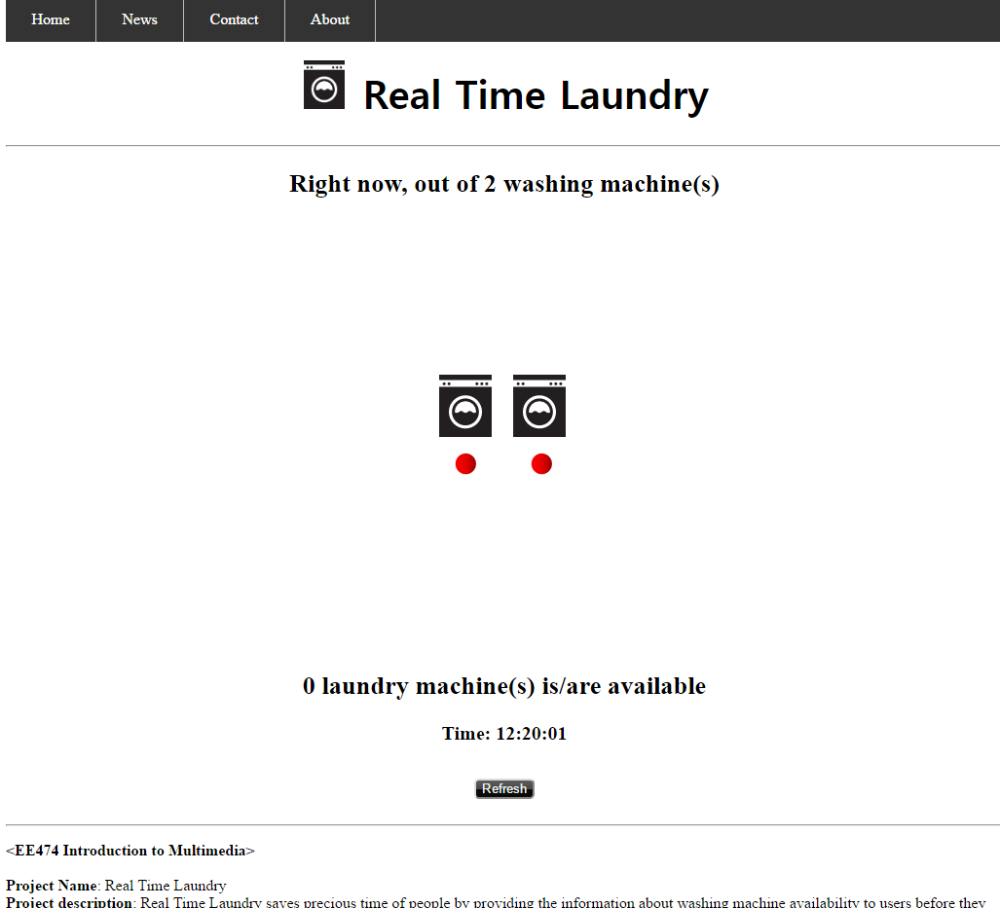

# Real Time Laundry

### What is Real Time Laundry?
Real Time Laundry is a system that notifies the availability of laundry machines in a public laundry room.

By having Real Time Laundry, people can monitor the availability of laundry machines and plan their trip efficiently to a public laundry room, saving their time and labor.

### How it works

Real Time Laundry consists of a camera and a server.

The camera is installed in a public laundry room, taking pictures of laundry machines every few minutes and sending them to the server via UDP.

The server receives the images and determines how many laundry machines are available with image processing (Laplacian of Gaussian filter) in real time.

The server then posts the information on Real Time Laundry website.

### Used
* MATLAB
* C
* HTML
* CSS
* ASP
* JavaScript
* Python
* Flask
* Linux
* Socket Programming

### Link
[link](https://awsong.000webhostapp.com/project/real_time_laundry.html)

\<KAIST EE474 Introduction to Multimedia>

\<Spring 2016>

\<Coded by Alan Wootae Song>